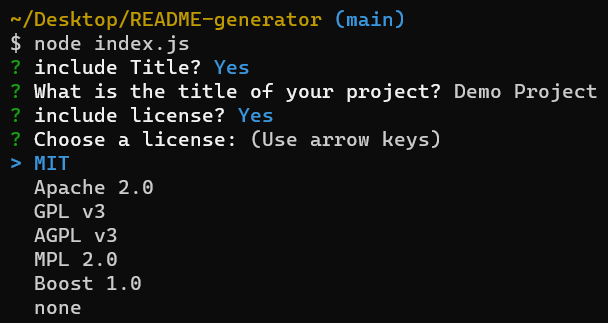
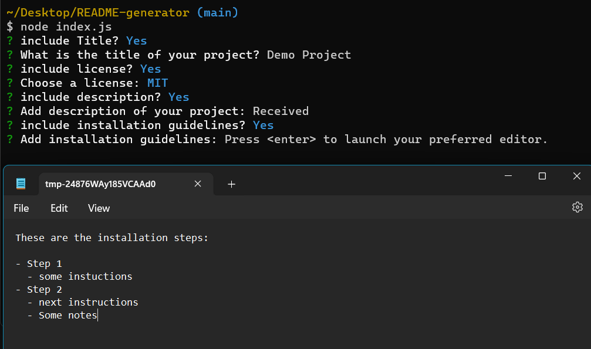

# README Generator

[](https://www.gnu.org/licenses/gpl-3.0)

## Description

A command-line application that allows you to quickly create a professional `README.md` for a new project.

- [README Generator](#readme-generator)
  - [Description](#description)
  - [Installation](#installation)
    - [Steps](#steps)
  - [Usage](#usage)
    - [Steps](#steps-1)
  - [Technologies/Languages](#technologieslanguages)
  - [Images](#images)
  - [License](#license)
  - [Contributing](#contributing)
  - [Questions](#questions)

## Installation

To install/use `README Generator` and it's dependecies, you will first need to have [Node.JS](https://nodejs.org/) installed on your machine.

Once you hav you have Node.js installed continue with the following steps:

### Steps

- Step 1
  - Clone/Fork [Repo](https://github.com/SebZG/README-generator) on to local machine.
- Step 2
  - Open terminal from root of `README-generator` Repo and install dependencies with the following commands:
  ```bash
  npm install
  ```

## Usage

For best experience, use external terminal from IDE

### Steps

- Step 1
  - Open terminal from root of `README-generator` Repo.
- Step 2
  - run the command:
  ```bash
  node index.js
  ```
- Step 3
  - Answer pompts - Some will open default text editor.
  - When inputting from text editor, SAVE file and close to continue.
  - If you do not save, your input will NOT be registered and will be prompted to provide input again.
- Step 4
  - When all prompts are answered a `README.md` will be generated and saved to the `./generated-readme` folder.

## Technologies/Languages

- JavaScript
- [Node.js](https://nodejs.org/)
- NPM
- [Inquirer](https://www.npmjs.com/package//inquirer)

## Demo Video


https://github.com/SebZG/README-generator/assets/91211862/4385490e-47cc-4f3a-87e7-ff04b229c395


## Images





## License

This application is covered under the GNU GPL v3 License.

## Contributing

For contributions you may contact me [here](https://github.com/SebZG).

## Questions

Visit my [GitHub](https://github.com/SebZG) profile.
